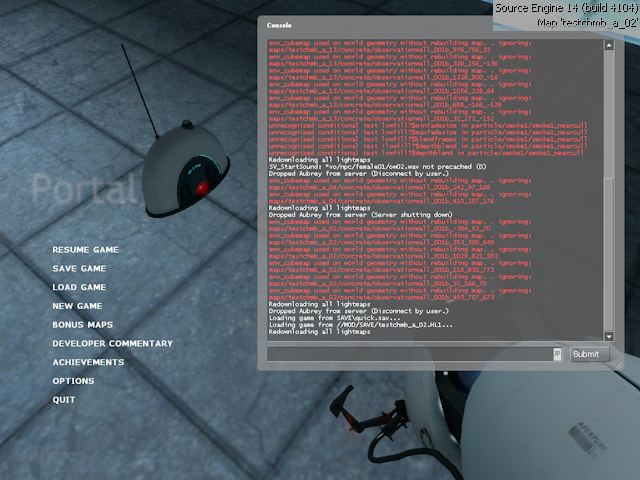

    
    <h1>Synthetic 4104</h1>

The very first version of Portal to have the "Transmission Received" update,
having the build number 4104, has free out-of-bounds movement, which later builds
(e.g. 5135) don't.

Unfortunately, this build is currently lost. For that reason, I have combined this
Source 2007 leak with code from [a 2018 leak](https://github.com/lua9520/source-engine-2018-hl2_src)
in order to make a sort of "fake 4104".

## Building

To build this, you will need a non-express version of Visual Studio 2005. I got
my version [here](https://archive.org/details/en_vs_2005_pro_dvd_202303).

1. Open `src_main/Game_SDK.sln` in Visual Studio 2005.
2. Build the "Client (Portal)" and "Server (Portal)" projects.

That's it! The outputted DLLs will be at the following paths:
- `src_main/game/client/Release_portal/Client.dll`
- `src_main/game/server/Release_portal/Server.dll`

## Other binaries, game assets

As you can see above, only the Portal-related DLLs are built. We don't actually
build the Source Engine ourselves. However, release includes all you need to play
this synthetic 4104, in typical Source Unpack format.

However, it is worth mentioning which versions I got all the assets from. You can
get most of the assets listed below from [SourceRuns](https://sourceruns.org/source/downloads/).

- Source Engine build 4104 from Episodic Unpack
- `portal` content folder from 5135 (Source Unpack)
- `portal/resource/**.res` files from 3420 ([download](https://drive.google.com/file/d/1xn4QAGXP0vasiysT473rxRstdX6oWZxi/view))
- `portal/bin/**.dll` files from this codebase!

With these resources, I have managed to create a mostly-functional replica of
Portal build 4104. I hope you enjoy it!